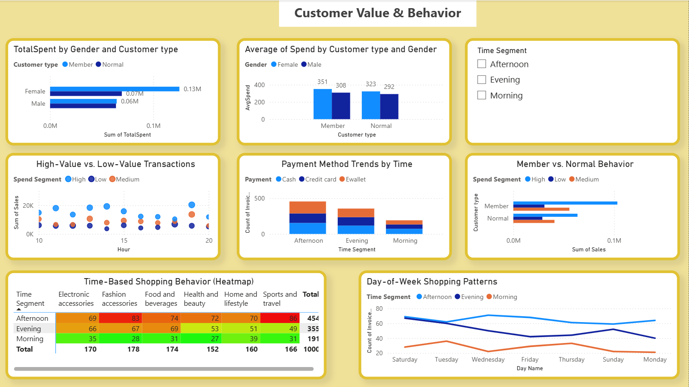
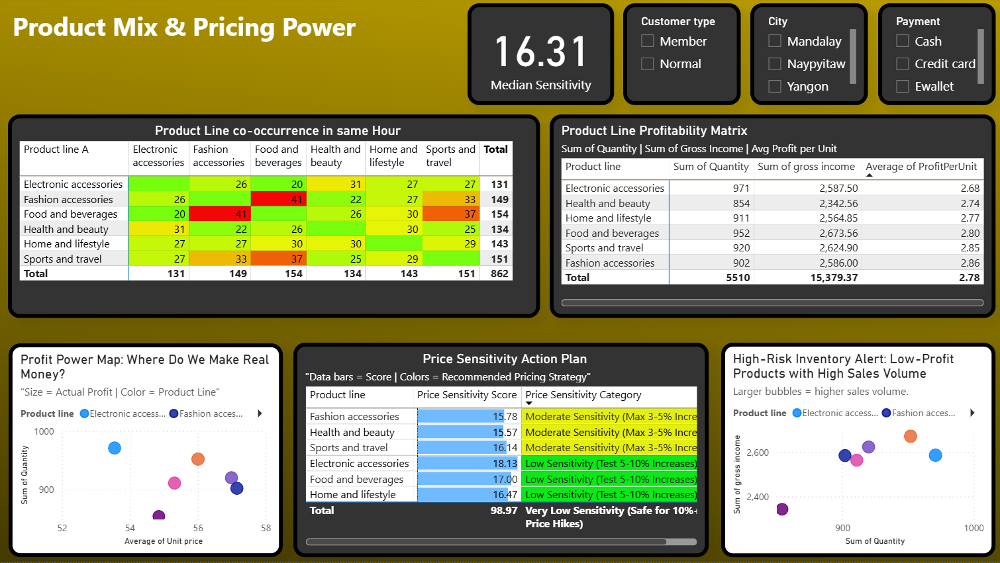
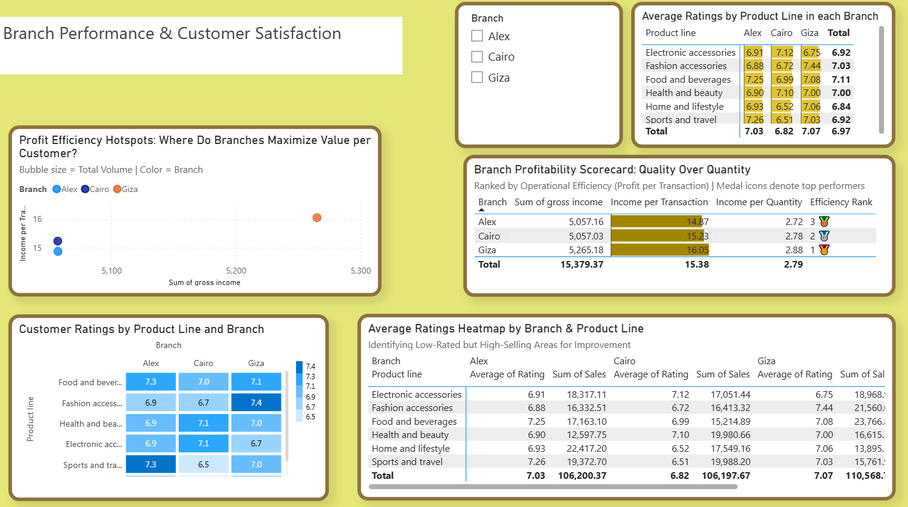

# 📊 Sales Dashboard using Power BI

An interactive Power BI dashboard built to analyze sales performance, customer behavior, and business trends. This project transforms raw sales data into meaningful insights through data cleaning, modeling, DAX measures, and interactive visualizations.

---

## 📌 Project Overview

The Sales Dashboard provides a comprehensive overview of business performance, enabling users to monitor key performance indicators (KPIs), identify sales trends, and make data-driven decisions.

The dashboard was developed using Power BI and includes interactive filters, charts, and KPI cards to help users explore sales data efficiently.

---

## 🎯 Objectives

- Monitor overall sales performance
- Track profit and revenue trends
- Analyze sales by product category and sub-category
- Identify top-performing products
- Analyze customer purchasing behavior
- Compare sales across regions
- Support business decision-making with interactive visualizations

---

## 🛠️ Tools & Technologies

- **Power BI Desktop**
- **Power Query**
- **DAX (Data Analysis Expressions)**
- **Microsoft Excel / CSV Dataset**

---

## 📂 Dataset

The dataset contains sales transaction records including:

- Order Date
- Customer Information
- Product Category
- Sub-category
- Product Name
- Sales
- Profit
- Quantity
- Region
- State
- Segment
- Shipping Mode

---

## 📈 Dashboard Features

### Executive Summary
- Total Sales
- Total Profit
- Total Orders
- Total Quantity Sold
- Profit Margin

### Sales Analysis
- Monthly Sales Trend
- Monthly Profit Trend
- Year-over-Year Comparison

### Product Performance
- Sales by Category
- Sales by Sub-category
- Top Selling Products
- Most Profitable Products

### Customer Analysis
- Sales by Customer Segment
- Top Customers
- Customer Contribution

### Regional Analysis
- Sales by Region
- Sales by State
- Regional Profit Comparison

### Interactive Features
- Date Slicer
- Region Filter
- Category Filter
- Segment Filter
- Cross-filtering between visuals

---

## 📊 Key Power BI Skills Demonstrated

- Data Cleaning using Power Query
- Data Modeling
- Relationship Management
- DAX Calculated Columns
- DAX Measures
- KPI Cards
- Interactive Dashboards
- Drill-through Analysis
- Slicers and Filters
- Data Visualization Best Practices

---

## 📷 Dashboard Preview





---

## 📁 Project Structure

```
Sales-Dashboard/

│
├── Sales Dashboard.pbix
│
├── Images/
│   └── dashboard.png
│
└── README.md
```

---

## 📌 Insights

Some insights that can be obtained from the dashboard include:

- Identify the best-selling product categories
- Monitor monthly sales growth
- Discover the most profitable products
- Compare regional sales performance
- Analyze customer purchasing trends
- Detect seasonal sales patterns

---

## 🚀 How to Use

1. Clone this repository

```bash
git clone https://github.com/yourusername/Sales-Dashboard.git
```

2. Open the `.pbix` file using **Power BI Desktop**

3. Refresh the dataset if necessary.

4. Explore the dashboard using the available filters and slicers.

---

## 📚 Learning Outcomes

Through this project, I gained practical experience in:

- Business Intelligence
- Data Visualization
- Dashboard Design
- Data Transformation
- DAX Calculations
- Interactive Reporting
- KPI Development

---

## 👨‍💻 Author

**San Kimheang**

Fresh Graduate in Data Science  
Institute of Technology of Cambodia (ITC)

GitHub: https://github.com/SanKimheang

LinkedIn: https://www.linkedin.com/in/kimheang-san-8279822b6/

---

## ⭐ If you like this project

Feel free to star this repository if you found it useful!
